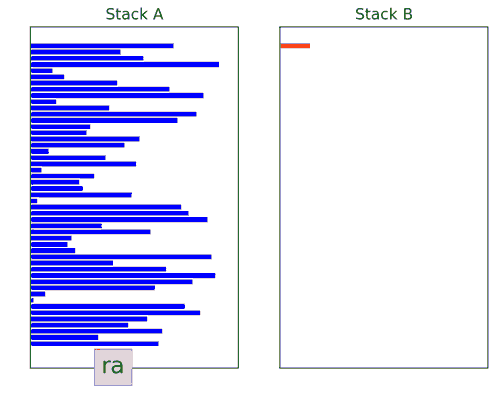

# push-swap
Sorting optimization problem under constraints. Two stacks and a given set of operations are used.

| Operations    | Description   |
|:-------------:|---------------|
| sa            | swap first two elements of stack A |
| sb            | swap first two elements of stack B |
| ss            | sa and sb at the same time |
| pa            | pops the first elememt on B and puts it on top of A |
| pb            | pops the first elememt on A and puts it on top of B |
| ra            | rotates forward stuck A up by one|
| rb            | rotates forward stuck B up by one |
| rr            | rotates forward both A and B up by one |
| rra           | rotates backward stuck A down by one |
| rrb           | rotates backward stuck B down by one |
| rrr           | rotates backward both A and B down by one |

Simple testing ruby script:
ARG=`ruby -e "puts (1..500).to_a.shuffle.join(' ')"`; ./push_swap $ARG | ./checker $ARG
Performances:
|Number entries	|Average number operations|
|3				|< 3|
|5				|< 12|
|100			|< 690|
|500			|< 4950|
